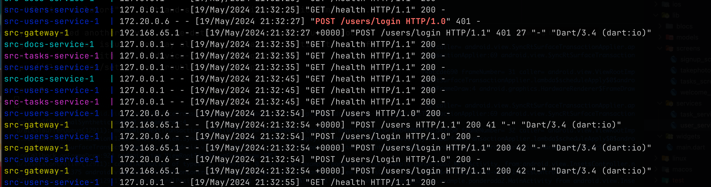

# Inteli módulo 10 ponderada 3 - App processador de imagens

Este é um aplicativo de gerenciamento de tarefas desenvolvido em Flutter. O objetivo deste aplicativo é fornecer uma interface simples para enviar imagens e conseguir a sua versão preto e branco.

## Tecnologias Utilizadas

- Flutter
- Dart
- Flask (Python)

## Funcionalidades

- Fazer login do usuário
- Criar um usuário
- Tirar uma foto
- Vizualizar a foto processada

### Funcionamento

https://github.com/Lemos1347/inteli-modulo-10-ponderada-3/assets/99190347/adfc4269-4e49-4134-aaec-953120794e53

### Logs



## Instalação

Para executar este projeto, você precisará ter o Flutter instalado em sua máquina. Para mais informações, veja a [documentação oficial do Flutter](https://flutter.dev/docs/get-started/install).

> [!NOTE]
> Esse projeto foi desenvolvido pensando em dispositivos mobile, por isso, é recomendado que você tenha um emulador ou um dispositivo físico para executar o aplicativo.

> [!IMPORTANT]
> Este projeto mobile para funcionar precisa que você mude o ip em que está rodando o backend, para isso vá até o arquivo [user_service.dart](./src/mobile/lib/services/user_service.dart) e mude a variável `baseUrl` em:  
> `final String baseUrl = 'http://{your_ipv4}:3000';`
> para o ip que está rodando o backend.

1. Clone o repositório:

   ```bash
   git clone https://github.com/Lemos1347/inteli-modulo-10-ponderada-3.git
   cd inteli-modulo-10-ponderada-3
   ```

2. Instale as dependências:

   ```bash
   cd mobile
   flutter pub get
   ```

3. Execute o projeto:
   ```bash
   flutter run
   ```

## Estrutura de diretórios

Dentro da pasta `src` você encontrará os seguintes arquivos / diretórios importantes.

### [mobile](./src/mobile/)

Este diretório contém todo o código fonte do aplicativo Flutter, com o seguinte esquema de pastas:

- [lib/](./src/mobile/lib/): Contém o código fonte do projeto.
- [lib/models/](./src/mobile/lib/models/): Definições de modelos de dados.
- [lib/blocs/](./src/mobile/lib/blocs/): Lógica de negócios e gerenciamento de estado.
- [lib/screens/](./src/mobile/lib/screens/): Telas do aplicativo.
- [lib/services/](./src/mobile/lib/services/): Serviços para comunicação com APIs externas.

### [src](./src/)

Este diretório contém todo o código fonte tanto do backend em python3 quanto do app mobile (sendo que o app se encontra totalmente dentro da pasta /mobile). O backend foi dividido entre microserviços e cada serviço pode ser encontrado dentro da sua respectiva pasta: `backend-{microserviço}`, sendo o [backend-gateway](./src/backend-gateway/) contendo toda a lógica de roteamento dos microserviços com `nginx`.

### [database](./src/database/)

Este diretório contém todos os scripts SQLs para criação do banco de dados da aplicação.

### [docker-compose.yml](./src/docker-compose.yml)

Este arquivo contém a configuração do docker-compose para subir o banco de dados e o backend. Para rodá-lo, basta executar o comando:

```bash
docker-compose up
```

Pronto! Agora você tem um backend rodando em `localhost:3000`e um banco de dados postgres configurado!

_Obs.: caso queira testar com as fotos existentes, pode acessar com o usuário henrique@email e a senha 123_
